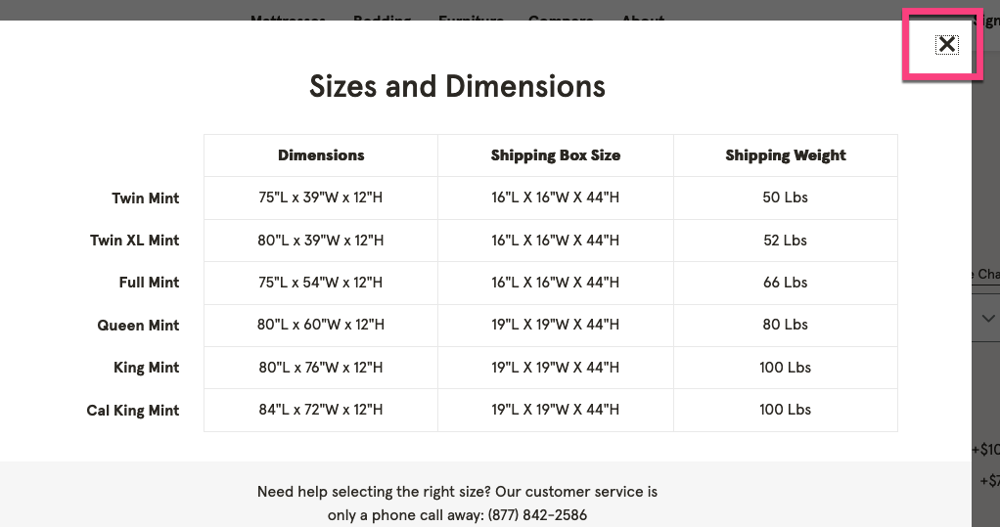

# Common Accessibility Pitfalls: Climbing out, when you fall in.

---

# Important Video


---

# What is Accessibility?

---

@quote[Web accesssibility means that people with disabilities can use the web.](www.w3.org/WAI/intro/acccessibility.php)

---

@quote[Web accesssibility means that <strong>EVERYONE</strong> can use the web.](Me)

---

# Across the World

@quote[Roughly 15% of the population has some type of disability.](World Health Organization)

---

# Why?

@css[text-white fragment](Why should we care about accessibility Chris?)

---


---

@fa[assistive-listening-systems fa-2x green]&nbsp;&nbsp;&nbsp;&nbsp;&nbsp;@fa[low-vision fa-2x green]&nbsp;&nbsp;&nbsp;&nbsp;&nbsp;
@fa[brain fa-2x green]&nbsp;&nbsp;&nbsp;&nbsp;&nbsp;
@fa[user-injured fa-2x green]&nbsp;&nbsp;&nbsp;&nbsp;&nbsp;
@fa[hands fa-2x green]&nbsp;&nbsp;&nbsp;&nbsp;&nbsp;

---

# Problems & Solutions

---

# Semantic Markup

---

@snap[north-west span-55]

#### Non-semantic

@snap[east span-50 green]

Accessible Markup Examples

@snapend

```html
<div class="...">
  <div class="..." id="...">
    <div class="..."></div>
  </div>
</div>
```

@snapend

@snap[south-west span-55]

#### Semantic

```html
<header>
  <nav>
    <ul>
      <li></li>
      <li></li>
    </ul>
  </nav>
</header>
<main>
  <section></section>
</main>
<footer></footer>
```

@snapend

---

# Alt attributes & images

---

@snap[north-west span-55]

#### Bad Practice

@snap[east span-50 green]

Alt Attribute Examples

@snapend

```html

```

@snapend

@snap[south-west span-55]

#### Best Practice

```html

```

---

# Color Contrast

Note:
- Color contrast is important because a user needs to be able to visually distinguish what is in the background, to what is in the foreground. For instance, if you have a white background with light gray text on top. That text would not be good color contrast. The text would start to blend in to the background.

---

# A, AA, AAA

---

# Level A

This should be hit no matter what. If you are doing everything in your power as web craftsperson, A will be hit.

---

# Level AA

---

@snap[north-west span-35 text-07]
@box[bg-green text-white box-padding](Large Text: Large-scale text and images of large-scale text have a contrast ratio of at least 3:1)
@snapend

@snap[north-east span-35 text-07]
@box[bg-orange text-white box-padding](Incidental: Text or images of text that are part of an inactive user interface component, that are pure decoration, that are not visible to anyone, or that are part of a picture that contains significant other visual content, have no contrast requirement.)
@snapend

@snap[south span-35 text-07]
@box[bg-pink text-white box-padding](Logotypes: Text that is part of a logo or brand name has no minimum contrast requirement.)
@snapend

@snap[midpoint]
## Level AA Compliance
### The visual presentation of text and images of text has a contrast ratio of at least 7:1, except for the following:
@snapend

---

# Level AAA

---

@snap[north-west span-35 text-07]
@box[bg-green text-white box-padding](Large Text: Large Text: Large-scale text and images of large-scale text have a contrast ratio of at least 4.5:1.)
@snapend

@snap[north-east span-35 text-07]
@box[bg-orange text-white box-padding](Incidental: Text or images of text that are part of an inactive user interface component, that are pure decoration, that are not visible to anyone, or that are part of a picture that contains significant other visual content, have no contrast requirement.)
@snapend

@snap[south span-35 text-07]
@box[bg-pink text-white box-padding](Logotypes: Text that is part of a logo or brand name has no minimum contrast requirement.)
@snapend

@snap[midpoint]
## Level AAA Compliance
### Contrast (Enhanced)
### The visual presentation of text and images of text has a contrast ratio of at least 7:1, except for the following:
@snapend

---

## More info on color contrast and an awesome tool in Chrome's DevTools, read this article.

[Chrome DevTools: Accessible Colors](https://uxdesign.cc/chrome-devtools-accessible-colors-300ec462a63c)

---

# ARIA
### Accessible Rich Internet Applications

---

# Number 1 rule of ARIA!
@css[fragment](Don't use ARIA!)

---

# What is ARIA?

@snap[fragment]
@quote[A set of attributes that define ways to make web content and web applicationsmore accessible to people with disabilities.](MDN (Mozilla Developer Network))
@snapend

Note:
- It supplements HTML so that interactions and widgets commonly used in applications can be passed to assistive technologies when there is not otherwise a mechanism.

---

# Common inaccessible patterns

---

# Social Media Icons

@fa[twitter fa-2x white]&nbsp;&nbsp;&nbsp;&nbsp;&nbsp;@fa[facebook-square fa-2x white]&nbsp;&nbsp;&nbsp;&nbsp;&nbsp;
@fa[linkedin fa-2x white]&nbsp;&nbsp;&nbsp;&nbsp;&nbsp;
@fa[instagram fa-2x white]&nbsp;&nbsp;&nbsp;&nbsp;&nbsp;

---

@snap[north-west span-55]

#### Bad Practice

@snap[east span-50 green]

ARIA Label Examples

@snapend

```html zoom-05
<span>
    <a href="#"><i class="fab fa-3x fa-twitter"></i></a>
</span>
<span>
    <a href="#"><i class="fab fa-3x fa-instagram"></i></a>
</span>
<span>
    <a href="#"><i class="fab fa-3x fa-facebook-f"></i></a>
</span>
```

@snapend

@snap[south-west span-55]

#### Best Practice

```html zoom-04
<!-- heading level needs to be informed by document structure, this is purely an example -->
<h4>Follow us on social media</h4>
<ul>
  <li>
    <a href="#" target="_blank">
      <i aria-label="Twitter" class="fa fa-twitter"></i>
      </a>
  </li>
  <li>
    <a href="#" target="_blank">
      <i aria-label="Facebook" class="fa fa-facebook"></i>
    </a>
  </li>
  <li>
    <a href="#" target="_blank">
      <i aria-label="LinkedIn" class="fa fa-linkedin"></i>
    </a>
  </li>
  <li>
    <a href="#" target="_blank">
      <i aria-label="Instagram" class="fa fa-instagram"></i>
    </a>
  </li>
</ul>
```

---

# Modals


